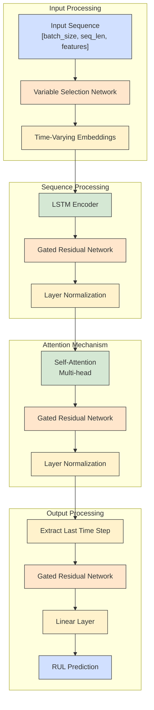

# Predictive Maintenance Models

This directory contains the implementation of different models for predictive maintenance using the NASA CMAPSS dataset.

## Available Models

### 1. Temporal Fusion Transformer (TFT)

The TFT model is the default and primary model for this project. It combines recurrent layers, self-attention, and specialized components like variable selection networks and gated residual networks to model temporal dependencies.

**Key Features:**
- Variable selection networks with attention
- Gated residual networks for stable training
- Self-attention mechanism for capturing temporal dependencies
- Feature importance analysis using attention weights

### 2. Simple LSTM Model

A simpler alternative that uses LSTM layers for sequence modeling. This model is more memory-efficient and can be used on systems with limited resources.

**Key Features:**
- LSTM-based sequence modeling
- Suitable for systems with limited computational resources
- Faster training time compared to TFT

## Feature Importance Analysis

The TFT model provides feature importance analysis capabilities through its attention mechanisms:

1. **Global Feature Importance**: Ranks all features based on their overall contribution to predictions across the entire dataset.

2. **Sample-Specific Feature Importance**: Shows which features were most important for individual predictions.

3. **Ranked Feature List**: Provides a detailed ranking of all features with their importance scores.

These insights help in:
- Understanding which sensors are most critical for RUL prediction
- Identifying potential maintenance priorities
- Focusing on the most relevant signals for monitoring equipment health

## Running the Models

### Default Pipeline (TFT Model)

```bash
python models/run_pipeline.py
```

### Using Simple LSTM Model

```bash
python models/run_pipeline.py --use_simple_model
```

### Running Only Evaluation with Feature Importance Analysis

```bash
python models/run_pipeline.py --skip_data_prep --skip_training
```

## Model Parameters

- `--hidden_size`: Hidden dimension size (default: 64)
- `--batch_size`: Batch size for training (default: 64)
- `--max_epochs`: Maximum number of training epochs (default: 50)
- `--learning_rate`: Learning rate (default: 0.001)

## Output Directories

- `transformer_data/`: Preprocessed data
- `checkpoints/`: Model checkpoints
- `evaluation_plots/`: Evaluation plots and feature importance visualizations

## Model Architecture

The TFT model is based on the paper ["Temporal Fusion Transformers for Interpretable Multi-horizon Time Series Forecasting"](https://arxiv.org/abs/1912.09363) by Lim et al. (2019). It includes the following components:

- **Gated Residual Networks (GRNs)**: Key building blocks that allow for better gradient flow
- **Variable Selection Networks**: Select the most relevant input variables at each time step
- **LSTM Encoders/Decoders**: Process sequential data
- **Multi-head Attention**: Capture dependencies between time steps
- **Interpretability**: Attention weights can be visualized for model interpretation

### Architecture Diagram



## Files

- `tft_model.py`: Implementation of the TFT model using PyTorch Lightning
- `tft_data_module.py`: PyTorch Lightning data module for loading CMAPSS data
- `train_tft.py`: Script for training the TFT model
- `evaluate_tft.py`: Script for evaluating the trained model

## Usage

### Training

To train the TFT model, run:

```bash
python models/train_tft.py --max_epochs 50 --batch_size 128 --hidden_size 64
```

Additional arguments:
- `--data_dir`: Directory containing the preprocessed data (default: 'transformer_data')
- `--batch_size`: Batch size for training and validation (default: 128)
- `--num_workers`: Number of workers for data loading (default: 4)
- `--hidden_size`: Hidden size for the model (default: 64)
- `--dropout`: Dropout rate (default: 0.1)
- `--num_lstm_layers`: Number of LSTM layers (default: 2)
- `--num_attention_heads`: Number of attention heads (default: 4)
- `--learning_rate`: Learning rate (default: 1e-3)
- `--max_epochs`: Maximum number of epochs (default: 50)
- `--patience`: Patience for early stopping (default: 10)
- `--log_dir`: Directory for TensorBoard logs (default: 'lightning_logs')
- `--ckpt_dir`: Directory for model checkpoints (default: 'checkpoints')
- `--gpus`: Number of GPUs to use (default: 1 if available, 0 otherwise)

### Evaluation

To evaluate a trained model, run:

```bash
python models/evaluate_tft.py --checkpoint_path checkpoints/tft-best.ckpt
```

Additional arguments:
- `--data_dir`: Directory containing the preprocessed data (default: 'transformer_data')
- `--batch_size`: Batch size for evaluation (default: 128)
- `--num_workers`: Number of workers for data loading (default: 4)
- `--checkpoint_path`: Path to the model checkpoint (required)
- `--plot_dir`: Directory to save evaluation plots (default: 'evaluation_plots')
- `--gpus`: Number of GPUs to use (default: 1 if available, 0 otherwise)

## Metrics

The model is evaluated using the following metrics:

- **RMSE (Root Mean Squared Error)**: Overall prediction accuracy
- **MAE (Mean Absolute Error)**: Average absolute prediction error
- **Precision@25_cycles**: Percentage of predictions within 25 cycles of the true RUL

## Visualization

The evaluation script generates the following plots:

- **True vs Predicted RUL**: Scatter plot of true vs predicted RUL values
- **Error Distribution**: Histogram of prediction errors
- **Attention Weights**: Visualization of attention weights (if available) 